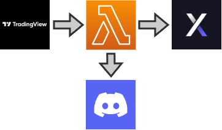

# Serverless Bot

  [](https://github.com/icyfry/serverless-bot/actions/workflows/build.yml) [](https://sonarcloud.io/summary/new_code?id=icyfry_serverless-bot)

> ⚠️ this is a experimentation project, DO NOT use it in a real use case, performance will most probably be negative.

A serverless bot to trigger automatic orders on dYdX



## Content

* `doc` documentation
* `src` source code of the serverless function
* `test` units and integration testing

## Development

### Tools
* [taskfile.dev](https://taskfile.dev/)

### Setup

Create a `.env` file
```
NETWORK=testnet
```

Install dependencies, run unit tests and build
```
pnpm install
pnpm run test-unit-only
pnpm build
```

`zlib-sync` may cause segmentation fault on local development while running unit tests and not using mock for the discord module

### Task Commands
* `task test` Run all tests
* `task build` Build with webpack
* `task build-and-deploy` Build and deploy to AWS
